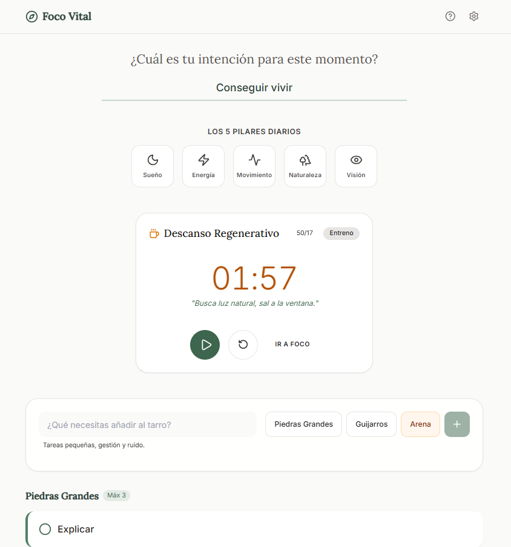

# 🌿 Foco Vital: The Art of Focus App
> Una aplicación de "Tecnología Calmada" diseñada con Inteligencia Artificial mediante metodologías de Vibe Coding.

## 📖 Descripción del Proyecto

**Foco Vital** es una implementación digital de los principios del libro *"El arte de concentrarte"* (Zelana Montminy). No es solo una lista de tareas; es un santuario digital diseñado para recuperar la atención en un mundo distraído.

La aplicación respeta la **Soberanía de Datos** (Local-First con IndexedDB) y utiliza principios de **Psicología Conductual** para la gestión del tiempo (Ciclos 50/17) y priorización (Metodología de las Piedras Grandes).

🔗 **Demo en vivo:** [https://ai.studio/apps/drive/1RijJMxoKihtjIs7BGxxy6OJfkeOfop0I]

---

## 🤖 Metodología: AI-Driven Development

Este proyecto no fue codificado línea a línea manualmente, sino **arquitectado**. He actuado como *Lead Technical Architect*, orquestando modelos de IA (LLMs) para generar una solución robusta en una ejecución "One-Shot".

### El Flujo de Trabajo (Vibe Coding)

Para lograr un resultado de calidad profesional en un solo intento, apliqué técnicas avanzadas de **Ingeniería de Contexto**:

1.  **Análisis Funcional:** Desglose del libro original en requerimientos técnicos y "User Stories".
2.  **Context Engineering (R-C-T-C-E):** Diseño de un *Prompt Maestro* estructurado en Rol, Contexto, Tarea, Restricciones y Ejemplo
3.  **Constraint Prompting:** Aplicación de restricciones férreas sobre el stack tecnológico (Vite, Tailwind) y el idioma (ES-España) para evitar alucinaciones de la IA.
4.  **Vibe Coding:** Traducción de sensaciones abstractas (calma, naturaleza, enfoque) a directrices de UI/UX concretas para el modelo

---

## 🚀 Habilidades Demostradas

Este repositorio sirve como evidencia de competencias transversales en el desarrollo de software moderno:

### 🧠 Habilidades Técnicas (Hard Skills)
* **Prompt Engineering Avanzado:** Capacidad para manipular el output de LLMs usando estructuras complejas (One-Shot, Chain of Thought).
* **Arquitectura de Software:** Definición de stacks modernos (React + Vite) y persistencia de datos (IndexedDB).
* **Revisión y Depuración de Código:** Validación de la calidad del código generado por IA y optimización de rendimiento.
* **Git & Despliegue:** Gestión de versiones y distribución de aplicaciones SPA.

### 💡 Habilidades Blandas (Soft Skills)
* **Traducción de Conceptos:** Capacidad para convertir literatura no técnica (un libro de psicología) en una especificación funcional de software.
* **Visión de Producto:** Enfoque en la experiencia de usuario (UX) y la filosofía "Calm Tech" por encima de la complejidad técnica innecesaria.
* **Gestión de la Atención:** Aplicación de los propios principios de productividad del proyecto en el flujo de trabajo de desarrollo.

---

## 🛠️ Stack Tecnológico

* **Core:** React 18 + Vite (Para un rendimiento ultrarrápido).
* **Estilos:** Tailwind CSS (Diseño atómico y paleta de colores "Sage Green").
* **Persistencia:** IndexedDB (Base de datos en el navegador, 100% privada).
* **Iconografía:** Lucide-React.

---

## 📸 Galería de la Interfaz

A continuación se muestran capturas de la aplicación funcionando, demostrando la estética minimalista y las funcionalidades clave.

  
  
<em>El Dashboard principal: "La Brújula" y los 5 Pilares</em>

---

Hecho con ❤️ y 🤖 por @alexcuar

# Run and deploy your AI Studio app

This contains everything you need to run your app locally.

View your app in AI Studio: https://ai.studio/apps/drive/1RijJMxoKihtjIs7BGxxy6OJfkeOfop0I

## Run Locally

**Prerequisites:**  Node.js

1. Install dependencies:
   `npm install`
2. Set the `GEMINI_API_KEY` in [.env.local](.env.local) to your Gemini API key
3. Run the app:
   `npm run dev`
